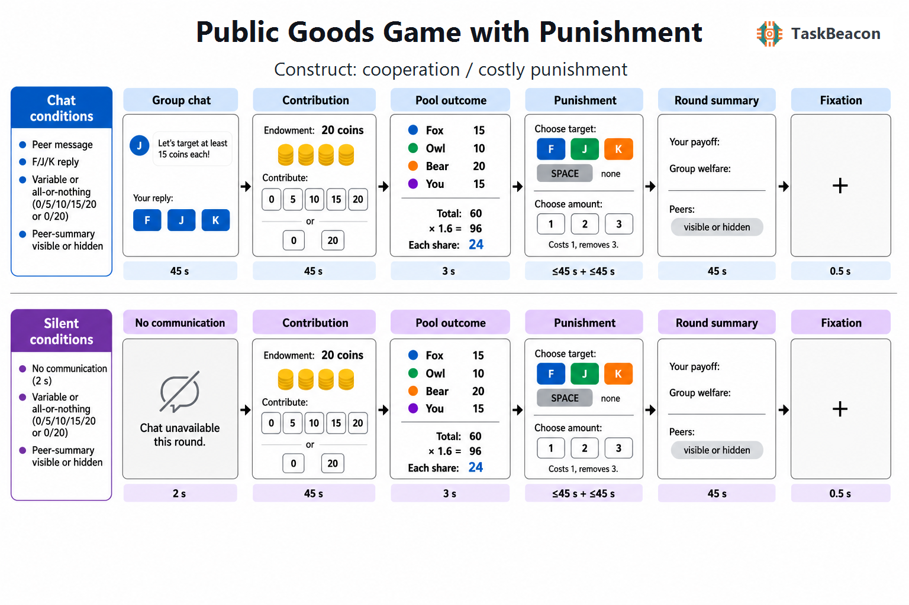

# Public Goods Game with Punishment

| Field                | Value                        |
|----------------------|------------------------------|
| Name                 | Public Goods Game with Punishment |
| Version              | v0.1.0 |
| URL / Repository     | https://github.com/TaskBeacon/T000122-public-goods-game-with-punishment |
| Short Description    | Four-person public-goods allocation task with costly peer punishment and configurable communication, outcome visibility, and contribution rules |
| Created By           | TaskBeacon |
| Date Updated         | 2026-08-29 |
| PsyFlow Version      | 0.1.0 |
| PsychoPy Version     | 2025.1.1 |
| Modality             | Behavior |
| Language             | Chinese |
| Voice Name           | zh-CN-YunyangNeural (disabled by default) |

## 1. Task Overview

Participants play repeated four-person public-goods rounds. Each member receives 20 coins and chooses how many to contribute to a common pool; the pool is multiplied by 1.6 and divided equally. After observing all contributions, the participant may pay one coin per punishment unit to remove three coins from one peer. Eight blocks cross communication availability, peer-summary visibility, and variable versus all-or-nothing contribution. Because the canonical PsyFlow runtime is single-participant, the other three members follow deterministic preplanned contribution sequences; this adaptation preserves the participant's allocation, sanction, payoff, and welfare measures from the supplied Science protocol.

## 2. Task Flow

### Block-Level Flow

| Step | Description |
|---|---|
| Load mode config | `main.py` selects the human, QA, scripted-simulation, or sampler-simulation YAML profile. |
| Initialize | Collect/inject subject ID; create `TaskSettings`, mock or serial triggers, PsychoPy window, keyboard, and preloaded `StimBank`. |
| Instructions | Present `instruction_overview`, `instruction_punishment`, and `instruction_factors`, each continued with Space. |
| Factor order | `ordered_conditions(...)` shuffles the eight factorial block IDs from `overall_seed + subject digits`; every cell occurs exactly once. |
| Block introduction | `block_heading`, `block_factors`, and `continue_prompt` disclose communication, visibility, contribution rule, and round count. |
| Preplan rounds | `make_block_plans(...)` attaches factor values, within-block round number, three peer names, and a rotated peer-contribution vector before `run_trial(...)`. |
| Execute block | `BlockUnit` emits block start/end triggers and runs two rounds in human mode or one mechanism-complete round in QA/simulation. |
| Block break | Between blocks, `block_break` shows completed blocks and the participant's current cumulative balance. |
| Final summary | `final_summary` reports valid rounds, mean contribution, punishment-unit total, mean group welfare, and final balance. |
| Save/close | Trial rows are written to CSV; the experiment-end trigger is sent and the trigger/window runtimes close. |

### Trial-Level Flow

| Phase | Participant-visible content and response | Timing |
|---|---|---:|
| Communication | In chat blocks, `peer_message` and `chat_options` offer three F/J/K replies; silent blocks show `no_chat_notice`. Chat has no mechanical payoff effect. | 45 s max or 2 s notice |
| Contribution | `contribution_rule_*` shows the 20-coin endowment, ×1.6 multiplier, and equal division. Variable blocks use keys 1–5 for 0/5/10/15/20; binary blocks use F/J for 0/20. | 45 s max |
| Pool outcome | `pool_roster` shows all four contributions; `pool_calculation` shows total, multiplied pot, and equal share. | 3 s |
| Punishment target | `punishment_roster` lists Fox/Owl/Bear contributions. F/J/K selects a peer; Space selects nobody. | 45 s max |
| Punishment amount | If a target was selected, keys 1/2/3 buy that many units; Space cancels. One unit costs the participant 1 coin and removes 3 from the target. | 45 s max |
| Summary | `summary_own` shows contribution, pool share, sanction cost, round payoff, balance, and group welfare. `summary_peer_visible` shows peer details or `summary_peer_hidden` states that they are unavailable. Space continues. | 45 s max |
| Inter-round interval | Centered `fixation` separates rounds. | 0.5 s |

### Controller Logic

| Feature | Description |
|---|---|
| Controller | None; there is no adaptive policy. |
| Factor schedule | Eight conditions are shuffled once per subject, not sampled by weight (`condition_weights: null`). |
| Peer schedule | Four concrete contribution triplets—18/10/2, 20/12/4, 15/15/5, and 20/5/0—are deterministically rotated by seed, block, and round. |
| State | Only cumulative participant balance is carried across rounds. All core factors and peer decisions are already in the preplanned condition dict. |

### Other Logic

| Rule | Implementation |
|---|---|
| Pool calculation | `round((own + three peer contributions) × 1.6)` then `round(multiplied pool / 4)`. |
| Own payoff | `20 − own contribution + pool share − punishment units × 1`. |
| Peer payoff | `20 − peer contribution + pool share`; the selected target additionally loses `punishment units × 3`. |
| Group welfare | Sum of own and three peer post-punishment payoffs, so both sanction cost and target loss reduce welfare. |
| Missing response | Contribution defaults to 0; chat records no message; punishment defaults to none/zero. |

## 3. Configuration Summary

All values below come from `config/config.yaml`; QA/simulation profiles retain the same semantics with one round per condition and scaled timing.

### a. Subject Info

| Field | Meaning |
|---|---|
| `subject_id` | Three-digit participant ID used with `overall_seed` to determine a reproducible block order. |

### b. Window Settings

| Parameter | Value |
|---|---|
| Size | 1280 × 800 px (1024 × 768 in QA/simulation) |
| Units | pixels |
| Background | `#F8FAFC` |
| Fullscreen | false |
| Monitor geometry | 35.5 cm width, 60 cm viewing distance |

### c. Stimuli

| Name | Type | Description |
|---|---|---|
| `instruction_*` | text | Three Chinese instruction screens describing pool, punishment, and factorial rules. |
| `block_heading`, `block_factors` | text | Current block number and concrete rule labels. |
| `peer_message`, `chat_options`, `no_chat_notice` | text | Communication manipulation and preset response content. |
| `contribution_rule_*`, `*_options` | text | Endowment/payoff rule and variable or binary allocation options. |
| `pool_roster`, `pool_calculation` | text | Four-member contribution roster and exact public-pool arithmetic. |
| `punishment_roster`, `punishment_rule` | text | Named targets, contributions, keys, sanction cost, and impact. |
| `selected_target`, `punishment_amount_options` | text | Selected peer and 1–3-unit sanction choices. |
| `summary_own`, `summary_peer_*` | text | Own round result and visibility-dependent peer details. |
| `fixation`, `block_break`, `final_summary` | text | Interval, inter-block, and final screens. |

### d. Timing

| Phase | Duration |
|---|---:|
| Communication response | 45 s max |
| No-communication notice | 2 s |
| Contribution response | 45 s max |
| Pool outcome | 3 s |
| Punishment target | 45 s max |
| Punishment amount | 45 s max when applicable |
| Summary | 45 s max |
| Inter-round interval | 0.5 s |

### e. Triggers

| Event | Code |
|---|---:|
| Experiment start / end | 1 / 2 |
| Block start / end | 10 / 11 |
| Communication / no communication | 20 / 21 |
| Chat response / timeout | 22 / 23 |
| Variable / binary contribution onset | 30 / 31 |
| Contribution response / timeout | 32 / 33 |
| Pool outcome | 40 |
| Punishment target onset / selected / none / timeout | 50 / 51 / 52 / 53 |
| Punishment amount onset / response / timeout | 54 / 55 / 56 |
| Visible / hidden summary onset | 60 / 61 |
| Summary continue / timeout | 62 / 63 |
| Inter-round interval | 70 |

## 4. Methods (for academic publication)

Participants completed a computerized Public Goods Game with Punishment implemented in PsychoPy/PsyFlow. They interacted with three program-controlled group members over eight rule blocks crossing communication availability, post-round peer-summary visibility, and contribution choice type (graded versus all-or-nothing). At the beginning of each round, every member received 20 coins. The participant selected a contribution of 0, 5, 10, 15, or 20 coins in graded blocks, or 0 versus 20 coins in all-or-nothing blocks. The four contributions were summed, multiplied by 1.6, rounded, and divided equally among the four members. Other-member contributions were determined before each trial by a seed-controlled schedule, making the complete session reproducible.

After pool feedback, the participant viewed each peer's contribution and could select one peer for costly punishment or decline punishment. A subsequent response specified one to three punishment units. Each unit cost the participant one coin and reduced the selected peer's round payoff by three coins. The participant then saw own contribution, pool return, sanction cost, round payoff, cumulative balance, and group welfare. Depending on the visibility condition, peer contribution and payoff summaries were either shown or explicitly hidden. Communication blocks presented a peer norm message and three neutral preset replies before contribution; communication had no programmed effect on peers or payoffs.

Interactive stages had source-aligned 45-s maximum response windows. Pool feedback lasted 3 s and the inter-round interval lasted 0.5 s. Human sessions comprised two rounds in each of eight factorial blocks (16 rounds). The use of deterministic peers, serialized communication, and a five-level graded contribution response are documented standalone adaptations of the synchronous multiplayer interface released with Alsobay et al. (2026); the endowment, public-pool equation, visibility factors, and costly punishment semantics remain source-aligned. Full evidence and inference mappings are available under `references/`.
